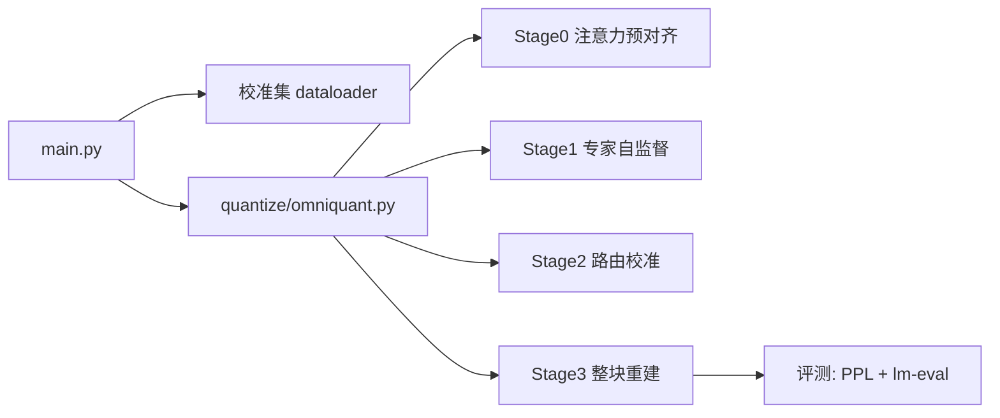

# myomni

这是基于 OmniQuant 改出来的 Qwen1.5-MoE / Qwen3 MoE 2-bit 量化实验代码库。

对应实验报告：飞书文档 `PKbndGuQtoqECFxBnBBlSO0cgvO`，revision `973`。

## 主要结构



- `main.py`：训练入口。负责解析参数、加载模型、构建校准集、调用 `omniquant`，最后跑 PPL / lm-eval。
- `quantize/omniquant.py`：主要训练逻辑。Qwen / DeepSeek MoE 走 staged decoupled 路径。
- `quantize/moe_utils.py`：MoE 专家选择、router score、packed experts、expert output 等工具。
- `quantize/block_evaluator.py`：Stage3 整块重建相关工具。
- `scripts/qwen/**`：报告里的 Qwen 实验脚本。
- `tests/stage0_smoke/`：单层 smoke 脚本，用于快速检查代码路径。

张量形状记忆点：每层校准 hidden states 主要按
`[nsamples, seqlen, hidden_size]` 缓存；每个 stage 只更新当前 decoder layer 中被开关选中的模块组。

## 模型路径

所有 Qwen 脚本默认使用 Hugging Face repo id：

- Qwen1.5：`Qwen/Qwen1.5-MoE-A2.7B`
- Qwen3：`Qwen/Qwen3-30B-A3B`

如果本机已经有模型，可以覆盖路径：

```bash
export QWEN15_MODEL_PATH=/tmp/Qwen1.5-MoE-A2.7B
export QWEN3_MODEL_PATH=/tmp/Qwen3-30B-A3B
```

下载两个模型到 `/tmp`：

```bash
bash scripts/qwen/download_models.sh
```

可选覆盖：

```bash
HF_ENDPOINT=https://hf-mirror.com \
QWEN15_DIR=/tmp/Qwen1.5-MoE-A2.7B \
QWEN3_DIR=/tmp/Qwen3-30B-A3B \
bash scripts/qwen/download_models.sh
```

## 报告脚本

脚本分别放在 `scripts/qwen/1.5/` 和 `scripts/qwen/3/`。

| 脚本 | 含义 |
|-|-|
| `D0_no_router_ep60.sh`, `D0_no_router_ep100.sh` | 仅 Stage3 baseline，不更新 router |
| `D1_stage0_stage1_attn_on.sh` | Stage0 开，Stage1 更新 attention，Stage3 不更新 attention |
| `D2_stage0_stage1_attn_off.sh` | Stage0 开，Stage1 不更新 attention，Stage3 不更新 attention |
| `D3_stage0_no_stage1.sh` | Stage0 开，Stage1 关闭，Stage3 不更新 attention |
| `D4_nostage0_stage3_noattn.sh` | Stage0 关，Stage1 不更新 attention，Stage3 不更新 attention |
| `D5_nostage0_stage3_attn.sh` | Stage0 关，Stage1 不更新 attention，Stage3 更新 attention |
| `D6_stage0_stage1attnoff_stage3attn.sh` | Stage0 开，Stage1 不更新 attention，Stage3 更新 attention |
| `D7_stage0_stage1attnon_stage3attn.sh` | Stage0 开，Stage1 更新 attention，Stage3 更新 attention |
| `D8_noaux.sh` | 在当前最佳配置上关闭 Stage3 aux router loss |
| `D9_topn8.sh` / `D9_topn12.sh` | 在当前最佳配置上扩大 Stage1 专家覆盖数 |

报告中的最佳配置：

- Qwen3：`scripts/qwen/3/D5_nostage0_stage3_attn.sh`
- Qwen1.5：`scripts/qwen/1.5/D7_stage0_stage1attnon_stage3attn.sh`

## 启动方式

单个实验：

```bash
CUDA_VISIBLE_DEVICES=0 bash scripts/qwen/1.5/D7_stage0_stage1attnon_stage3attn.sh
```

单层 smoke：

```bash
bash tests/stage0_smoke/run_qwen1p5_stage0_single_layer.sh
```

## 常用参数

| 参数 | 作用 |
|-|-|
| `--wbits 2 --attn_wbits 4 --abits 16 --group_size 128` | 报告中的量化配置 |
| `--lwc --lwc_lr 0.026` | Learnable Weight Clipping |
| `--use_linear_lora --linear_lora_r 32 --linear_lora_alpha 64.0 --linear_lora_lr 0.0002` | 2-bit 实验使用的 Linear LoRA |
| `--stage0_attn_epochs N` | Stage0 注意力预对齐；`0` 表示关闭 |
| `--epochs N` | Stage1 专家自监督轮数 |
| `--no-stage1_update_attn` | Stage1 冻结 attention |
| `--stage2_enable_calibration --stage2_use_kl --stage2_router_epochs 15` | Stage2 router 校准 |
| `--k_loss` / `--k_routing` | 报告中 Qwen1.5 为 `20/4`，Qwen3 为 `30/8` |
| `--quant_routing_top_n` | D9 使用，扩大 Stage1 专家覆盖数 |
| `--stage3_enable_block_update --stage3_block_update_epochs 40` | Stage3 整块重建 |
| `--stage3_update_attn --stage3_update_router --stage3_update_expert` | Stage3 允许更新的模块组 |
| `--stage3_aux_loss --stage3_aux_loss_weight 0.1 --stage3_aux_loss_use_kl` | Stage3 router 辅助损失 |
| `--max_train_layers 1` | 快速调试；只训练前 N 层，后续层保持全精度 |

## 报告公共配置

- 专家权重：2-bit
- 注意力权重：4-bit
- 激活：16-bit
- `group_size=128`
- 校准集：`wikitext2`
- 校准样本数：`128`
- batch size：`8`
- Stage2：KL loss，`15` 轮
- Qwen3：`k_loss=30`，`k_routing=8`
- Qwen1.5：`k_loss=20`，`k_routing=4`

## 可复现性说明

本分支只做低风险整理，训练计算路径保持不变：

- `main.py` 只移除了调试输出和未使用的调试 import。
- `quantize/omniquant.py` 只把非有限 reconstruction loss 分支从 `pdb.set_trace()` 改成抛 `FloatingPointError`。
- 正常 loss 为有限值时，`omniquant.py` 的 loss、backward、GradScaler、optimizer step 路径不变。
- 脚本里的 HDFS 模型路径改为 Hugging Face repo id，并保留环境变量覆盖。

因此，在模型权重、依赖环境、校准数据、随机种子和脚本参数一致的前提下，可以认为训练效果与报告脚本等同；不承诺 CUDA / AMP 下逐 bit 完全一致。

## 注意事项

- 改代码后优先用 `--max_train_layers 1` 做路径检查，再跑完整实验。
- `scripts/qwen/logs/` 和 `tests/stage0_smoke/*.log|*.pth` 是运行产物，已被忽略。
- 如果本机没有模型，先跑 `scripts/qwen/download_models.sh` 或设置本地模型路径环境变量。
